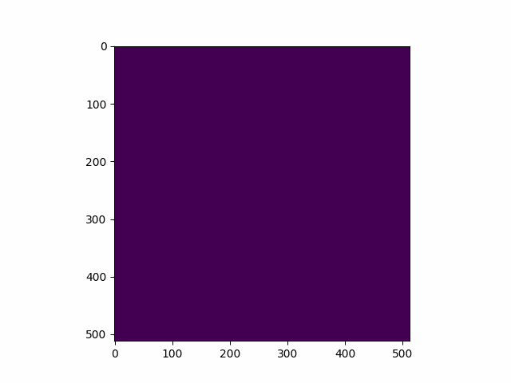

# Research Blog

I think this blog looks better than medium tbh. Especially since I can shoot off with
$$
\nabla \cdot \vec{E} = \frac{\rho}{\epsilon_0} 
$$
and 
$$
\nabla \cdot \vec{J} = - \frac{\partial \rho }{\partial t}
$$
whenever I feel like it. I really do love math. It makes things obvious. I don't necessarily need a million examples of what's being done, just show me the equation. Then a couple dozen to a few hundred examples to really get familiar with the process. :joy:

So I guess the topic of this blog is to make some statements about what I'd like the topic of this blog to be so I can come back a year or more later and see it abandoned and the goals unfulfilled, but I'd really rather not keep doing that.

I've been looking at [the code]() for the [`Longformer`](https://arxiv.org/abs/2004.05150) sparse global + dense sliding local attention attention mechanism.

## Local attention
Here's a critical part of the code that shows how the key and query matrices are combined for sliding window local self-attention on a long sequence. The process for the attention probabilities and the value matrices are not disimilar.
```python
def _sliding_chunks_query_key_matmul(self, query: torch.Tensor, key: torch.Tensor, window_overlap: int):
        """
        Matrix multiplication of query and key tensors using with a sliding window attention pattern. This
        implementation splits the input into overlapping chunks of size 2w (e.g. 512 for pretrained Longformer) with an
        overlap of size window_overlap
        """
        batch_size, seq_len, num_heads, head_dim = query.size()
        assert (
            seq_len % (window_overlap * 2) == 0
        ), f"Sequence length should be multiple of {window_overlap * 2}. Given {seq_len}"
        assert query.size() == key.size()

        chunks_count = seq_len // window_overlap - 1

        # group batch_size and num_heads dimensions into one, then chunk seq_len into chunks of size window_overlap * 2
        query = query.transpose(1, 2).reshape(batch_size * num_heads, seq_len, head_dim)
        key = key.transpose(1, 2).reshape(batch_size * num_heads, seq_len, head_dim)

        query = self._chunk(query, window_overlap)
        key = self._chunk(key, window_overlap)

        # NOTE:
        # By chunking the input sequence into a higher dimenstional tensor
        # they just limited the scope of the attention mechanism.

        # matrix multiplication
        # bcxd: batch_size * num_heads x chunks x 2window_overlap x head_dim
        # bcyd: batch_size * num_heads x chunks x 2window_overlap x head_dim
        # bcxy: batch_size * num_heads x chunks x 2window_overlap x 2window_overlap
        diagonal_chunked_attention_scores = torch.einsum("bcxd,bcyd->bcxy", (query, key))  # multiply

        # NOTE: 
        # Isn't this neat? So they've got (multi-headed) attention prob matrices 
        # for each of the overlapping chunks in the input sequence.
        # Now they need to spread these attention probs across the larger
        # matrix of attention for the entire input sequence.

        # convert diagonals into columns
        diagonal_chunked_attention_scores = self._pad_and_transpose_last_two_dims(
            diagonal_chunked_attention_scores, padding=(0, 0, 0, 1)
        )

        # allocate space for the overall attention matrix where the chunks are combined. The last dimension
        # has (window_overlap * 2 + 1) columns. The first (window_overlap) columns are the window_overlap lower triangles (attention from a word to
        # window_overlap previous words). The following column is attention score from each word to itself, then
        # followed by window_overlap columns for the upper triangle.

        # NOTE: 
        # seq_len is not present here! This is an intermediate representation 
        # for each overlapping chunk.

        diagonal_attention_scores = diagonal_chunked_attention_scores.new_empty(
            (batch_size * num_heads, chunks_count + 1, window_overlap, window_overlap * 2 + 1)
        )

        # copy parts from diagonal_chunked_attention_scores into the combined matrix of attentions
        # - copying the main diagonal and the upper triangle
        diagonal_attention_scores[:, :-1, :, window_overlap:] = diagonal_chunked_attention_scores[
            :, :, :window_overlap, : window_overlap + 1
        ]
        diagonal_attention_scores[:, -1, :, window_overlap:] = diagonal_chunked_attention_scores[
            :, -1, window_overlap:, : window_overlap + 1
        ]
        # - copying the lower triangle
        diagonal_attention_scores[:, 1:, :, :window_overlap] = diagonal_chunked_attention_scores[
            :, :, -(window_overlap + 1) : -1, window_overlap + 1 :
        ]

        diagonal_attention_scores[:, 0, 1:window_overlap, 1:window_overlap] = diagonal_chunked_attention_scores[
            :, 0, : window_overlap - 1, 1 - window_overlap :
        ]

        # NOTE: 
        # They expand it back to the sequence length with .view()

        # separate batch_size and num_heads dimensions again
        diagonal_attention_scores = diagonal_attention_scores.view(
            batch_size, num_heads, seq_len, 2 * window_overlap + 1
        ).transpose(2, 1)
        # NOTE:
        # output size is batch_size X seq_len X num_heads X 2 * windown_overlap + 1

        self._mask_invalid_locations(diagonal_attention_scores, window_overlap)
        return diagonal_attention_scores
```

And that's a good idea of how the dense sliding local attention mechanism works for `Longformer`.  Here's a graphic showing what's it's doing across the sequence.  

.

There are dense attention probabilities for the every token in the sequence along the diagonal of the attention matrix. The sliding window densely attends every token with it's local neighborhood.

## Global attention

So how does global attention get included then? Seems like different parts of the document should be relevant to each other even if separated by great lengths in the text. Let's look at the global attention mechanism again from `Longformer` in the huggingface transformers library.

Let's refresh how self-attention works real quick. So we've got a sequence of vectors $x_i$ that are our word embeddings of rank $d = dim_{embedding}$.  
The way learned self-attention works in the transformer is we have our projections of the inputs:
$$ 
q_i = W_q x_i \\
k_i = W_k x_i \\
v_i = W_v x_i \\
$$
Then we compute the pairwise attention probabilites $w_{ij}$ between $x_i$ and $x_j$ $ \forall (i,j)$ by the following
$$
w_{ij}' = q_i^T k_j \\
w_{ij} = softmax(w_{ij}').
$$
We then use these pairwise attention probabilities to generate the output of the transformer $y_i$ with 
$$
y_i = \sum_j w_{ij} v_j.
$$

Okay, so now that we're refreshed on that, we can take a look at the following with fresh eyes.
```python
    def _concat_with_global_key_attn_probs(
        self,
        key_vectors,
        query_vectors,
        max_num_global_attn_indices,
        is_index_global_attn_nonzero,
        is_local_index_global_attn_nonzero,
        is_local_index_no_global_attn_nonzero,
    ):
        batch_size = key_vectors.shape[0]

        # create only global key vectors
        key_vectors_only_global = key_vectors.new_zeros(
            batch_size, max_num_global_attn_indices, self.num_heads, self.head_dim
        )
        # NOTE:
        # key vectors is seq_len long, we're selecting a subset
        # and packing them into key_vectors_only_global with
        # a mapping defined by 
        #   is_local_index_global_attn_nonzero
        key_vectors_only_global[is_local_index_global_attn_nonzero] = key_vectors[is_index_global_attn_nonzero]

        # (batch_size, seq_len, num_heads, max_num_global_attn_indices)
        # Compute the global attention between the global 
        # token subset  as the key and the whole query.
        attn_probs_from_global_key = torch.einsum("blhd,bshd->blhs", (query_vectors, key_vectors_only_global))

        attn_probs_from_global_key[
            is_local_index_no_global_attn_nonzero[0], :, :, is_local_index_no_global_attn_nonzero[1]
        ] = -10000.0

        return attn_probs_from_global_key

```
Which shows you a lot about how they're doing this. They're taking the full query and using a subset of the key vectors to compute a global attention tensor of size `[batch_size, max_num_global_attn_indices, num_heads, head_dim]`. That's where they store the attention between a few tokens and the whole sequence, this time in the form of the query. Now you see why we needed to review a bit about the math behind learned self-attention?


There are a few more methods where you can see this
```python
    def _get_global_attn_indices(is_index_global_attn):
        """compute global attn indices required throughout forward pass"""
        # helper variable
        num_global_attn_indices = is_index_global_attn.long().sum(dim=1)

        # max number of global attn indices in batch
        max_num_global_attn_indices = num_global_attn_indices.max()

        # indices of global attn
        is_index_global_attn_nonzero = is_index_global_attn.nonzero(as_tuple=True)

        # helper variable
        is_local_index_global_attn = torch.arange(
            max_num_global_attn_indices, device=is_index_global_attn.device
        ) < num_global_attn_indices.unsqueeze(dim=-1)

        # location of the non-padding values within global attention indices
        is_local_index_global_attn_nonzero = is_local_index_global_attn.nonzero(as_tuple=True)

        # location of the padding values within global attention indices
        is_local_index_no_global_attn_nonzero = (is_local_index_global_attn == 0).nonzero(as_tuple=True)
        return (
            max_num_global_attn_indices,
            is_index_global_attn_nonzero,
            is_local_index_global_attn_nonzero,
            is_local_index_no_global_attn_nonzero,
        )
```
so that's how we map between the local and global attention matrices from `is_index_global_attn`, which I believe is a parameter that's experimented with at runtime. Maybe the next blog will cover that in more depth. For now we're just going to dig into Longformer's combined global and local sliding window attention mechanism.


Okay now here's how they're doing it on the other side. After `attn_probs` has already been calculated with $w_{ij} = softmax(q_i^T k_j)$, except $k_j$ is a subset of the entire sequence where `is_index_global_attn[i]` is nonzero.
```python

    def _compute_attn_output_with_global_indices(
        self,
        value_vectors,
        attn_probs,
        max_num_global_attn_indices,
        is_index_global_attn_nonzero,
        is_local_index_global_attn_nonzero,
    ):
        batch_size = attn_probs.shape[0]

        # NOTE:
        # attn_probs is getting sliced down 
        # cut local attn probs to global only
        attn_probs_only_global = attn_probs.narrow(-1, 0, max_num_global_attn_indices)
        # get value vectors for global only
        value_vectors_only_global = value_vectors.new_zeros(
            batch_size, max_num_global_attn_indices, self.num_heads, self.head_dim
        )

        # NOTE:
        # Now we copy over values from whole value_vectors into
        # truncated value_vectors_only_global
        value_vectors_only_global[is_local_index_global_attn_nonzero] = value_vectors[is_index_global_attn_nonzero]

        # use `matmul` because `einsum` crashes sometimes with fp16
        # attn = torch.einsum('blhs,bshd->blhd', (selected_attn_probs, selected_v))
        # compute attn output only global
        # NOTE: they're only doing the attention for the value
        # vectors that are a part of global subset with the 
        # subset of the the global attention probs
        attn_output_only_global = torch.matmul(
            attn_probs_only_global.transpose(1, 2), value_vectors_only_global.transpose(1, 2)
        ).transpose(1, 2)

        # reshape attn probs
        attn_probs_without_global = attn_probs.narrow(
            -1, max_num_global_attn_indices, attn_probs.size(-1) - max_num_global_attn_indices
        ).contiguous()

        # compute attn output with global
        # NOTE:
        # This just does the attention across sequence
        # without the global connections
        attn_output_without_global = self._sliding_chunks_matmul_attn_probs_value(
            attn_probs_without_global, value_vectors, self.one_sided_attn_window_size
        )
        # NOTE:
        # We add our global attentions
        return attn_output_only_global + attn_output_without_global

```

Now we have some idea of how these things are working underneath the hood, let's see how they fit together.
```python
class LongformerSelfAttention(nn.Module):
    def __init__(self, config, layer_id):
        super().__init__()
        if config.hidden_size % config.num_attention_heads != 0:
            raise ValueError(
                f"The hidden size ({config.hidden_size}) is not a multiple of the number of attention "
                f"heads ({config.num_attention_heads})"
            )
        self.num_heads = config.num_attention_heads
        self.head_dim = int(config.hidden_size / config.num_attention_heads)
        self.embed_dim = config.hidden_size

        self.query = nn.Linear(config.hidden_size, self.embed_dim)
        self.key = nn.Linear(config.hidden_size, self.embed_dim)
        self.value = nn.Linear(config.hidden_size, self.embed_dim)

        # separate projection layers for tokens with global attention
        self.query_global = nn.Linear(config.hidden_size, self.embed_dim)
        self.key_global = nn.Linear(config.hidden_size, self.embed_dim)
        self.value_global = nn.Linear(config.hidden_size, self.embed_dim)

        self.dropout = config.attention_probs_dropout_prob

        self.layer_id = layer_id
        attention_window = config.attention_window[self.layer_id]
        assert (
            attention_window % 2 == 0
        ), f"`attention_window` for layer {self.layer_id} has to be an even value. Given {attention_window}"
        assert (
            attention_window > 0
        ), f"`attention_window` for layer {self.layer_id} has to be positive. Given {attention_window}"

        self.one_sided_attn_window_size = attention_window // 2

    def forward(
        self,
        hidden_states,
        attention_mask=None,
        layer_head_mask=None,
        is_index_masked=None,
        is_index_global_attn=None,
        is_global_attn=None,
        output_attentions=False,
    ):
        """
        :class:`LongformerSelfAttention` expects `len(hidden_states)` to be multiple of `attention_window`. Padding to
        `attention_window` happens in :meth:`LongformerModel.forward` to avoid redoing the padding on each layer.

        The `attention_mask` is changed in :meth:`LongformerModel.forward` from 0, 1, 2 to:

            * -10000: no attention
            * 0: local attention
            * +10000: global attention
        """
        hidden_states = hidden_states.transpose(0, 1)

        # project hidden states
        query_vectors = self.query(hidden_states)
        key_vectors = self.key(hidden_states)
        value_vectors = self.value(hidden_states)

        seq_len, batch_size, embed_dim = hidden_states.size()
        assert (
            embed_dim == self.embed_dim
        ), f"hidden_states should have embed_dim = {self.embed_dim}, but has {embed_dim}"

        # normalize query
        query_vectors /= math.sqrt(self.head_dim)

        query_vectors = query_vectors.view(seq_len, batch_size, self.num_heads, self.head_dim).transpose(0, 1)
        key_vectors = key_vectors.view(seq_len, batch_size, self.num_heads, self.head_dim).transpose(0, 1)

        attn_scores = self._sliding_chunks_query_key_matmul(
            query_vectors, key_vectors, self.one_sided_attn_window_size
        )

        # values to pad for attention probs
        remove_from_windowed_attention_mask = (attention_mask != 0)[:, :, None, None]

        # cast to fp32/fp16 then replace 1's with -inf
        float_mask = remove_from_windowed_attention_mask.type_as(query_vectors).masked_fill(
            remove_from_windowed_attention_mask, -10000.0
        )
        # diagonal mask with zeros everywhere and -inf inplace of padding
        diagonal_mask = self._sliding_chunks_query_key_matmul(
            float_mask.new_ones(size=float_mask.size()), float_mask, self.one_sided_attn_window_size
        )

        # pad local attention probs
        attn_scores += diagonal_mask

        assert list(attn_scores.size()) == [
            batch_size,
            seq_len,
            self.num_heads,
            self.one_sided_attn_window_size * 2 + 1,
        ], f"local_attn_probs should be of size ({batch_size}, {seq_len}, {self.num_heads}, {self.one_sided_attn_window_size * 2 + 1}), but is of size {attn_scores.size()}"

        # compute local attention probs from global attention keys and contact over window dim
        if is_global_attn:
            # compute global attn indices required through out forward fn
            (
                max_num_global_attn_indices,
                is_index_global_attn_nonzero,
                is_local_index_global_attn_nonzero,
                is_local_index_no_global_attn_nonzero,
            ) = self._get_global_attn_indices(is_index_global_attn)
            # calculate global attn probs from global key

            global_key_attn_scores = self._concat_with_global_key_attn_probs(
                query_vectors=query_vectors,
                key_vectors=key_vectors,
                max_num_global_attn_indices=max_num_global_attn_indices,
                is_index_global_attn_nonzero=is_index_global_attn_nonzero,
                is_local_index_global_attn_nonzero=is_local_index_global_attn_nonzero,
                is_local_index_no_global_attn_nonzero=is_local_index_no_global_attn_nonzero,
            )
            # concat to local_attn_probs
            # (batch_size, seq_len, num_heads, extra attention count + 2*window+1)
            attn_scores = torch.cat((global_key_attn_scores, attn_scores), dim=-1)

            # free memory
            del global_key_attn_scores

        attn_probs = nn.functional.softmax(
            attn_scores, dim=-1, dtype=torch.float32
        )  # use fp32 for numerical stability

        if layer_head_mask is not None:
            assert layer_head_mask.size() == (
                self.num_heads,
            ), f"Head mask for a single layer should be of size {(self.num_heads,)}, but is {layer_head_mask.size()}"
            attn_probs = layer_head_mask.view(1, 1, -1, 1) * attn_probs

        # softmax sometimes inserts NaN if all positions are masked, replace them with 0
        attn_probs = torch.masked_fill(attn_probs, is_index_masked[:, :, None, None], 0.0)
        attn_probs = attn_probs.type_as(attn_scores)

        # free memory
        del attn_scores

        # apply dropout
        attn_probs = nn.functional.dropout(attn_probs, p=self.dropout, training=self.training)

        value_vectors = value_vectors.view(seq_len, batch_size, self.num_heads, self.head_dim).transpose(0, 1)

        # compute local attention output with global attention value and add
        if is_global_attn:
            # compute sum of global and local attn
            attn_output = self._compute_attn_output_with_global_indices(
                value_vectors=value_vectors,
                attn_probs=attn_probs,
                max_num_global_attn_indices=max_num_global_attn_indices,
                is_index_global_attn_nonzero=is_index_global_attn_nonzero,
                is_local_index_global_attn_nonzero=is_local_index_global_attn_nonzero,
            )
        else:
            # compute local attn only
            attn_output = self._sliding_chunks_matmul_attn_probs_value(
                attn_probs, value_vectors, self.one_sided_attn_window_size
            )

        assert attn_output.size() == (batch_size, seq_len, self.num_heads, self.head_dim), "Unexpected size"
        attn_output = attn_output.transpose(0, 1).reshape(seq_len, batch_size, embed_dim).contiguous()

        # compute value for global attention and overwrite to attention output
        # TODO: remove the redundant computation
        if is_global_attn:
            global_attn_output, global_attn_probs = self._compute_global_attn_output_from_hidden(
                hidden_states=hidden_states,
                max_num_global_attn_indices=max_num_global_attn_indices,
                layer_head_mask=layer_head_mask,
                is_local_index_global_attn_nonzero=is_local_index_global_attn_nonzero,
                is_index_global_attn_nonzero=is_index_global_attn_nonzero,
                is_local_index_no_global_attn_nonzero=is_local_index_no_global_attn_nonzero,
                is_index_masked=is_index_masked,
            )

            # get only non zero global attn output
            nonzero_global_attn_output = global_attn_output[
                is_local_index_global_attn_nonzero[0], :, is_local_index_global_attn_nonzero[1]
            ]

            # overwrite values with global attention
            attn_output[is_index_global_attn_nonzero[::-1]] = nonzero_global_attn_output.view(
                len(is_local_index_global_attn_nonzero[0]), -1
            )
            # The attention weights for tokens with global attention are
            # just filler values, they were never used to compute the output.
            # Fill with 0 now, the correct values are in 'global_attn_probs'.
            attn_probs[is_index_global_attn_nonzero] = 0

        outputs = (attn_output.transpose(0, 1),)

        if output_attentions:
            outputs += (attn_probs,)

        return outputs + (global_attn_probs,) if (is_global_attn and output_attentions) else outputs
```

So we return the `outputs` which in this case is `attn_probs` for the whole sequence, and if this is a global attention mechanism, we also append `global_attn_probs` as well.

I've still got miles to go before I sleep, but I think I'm going to slap a big **DONE** label on this for today. Much better way of going through code than just staring at it for hourse. Mark it up in a markdown document. Rubber duck method my way through it.